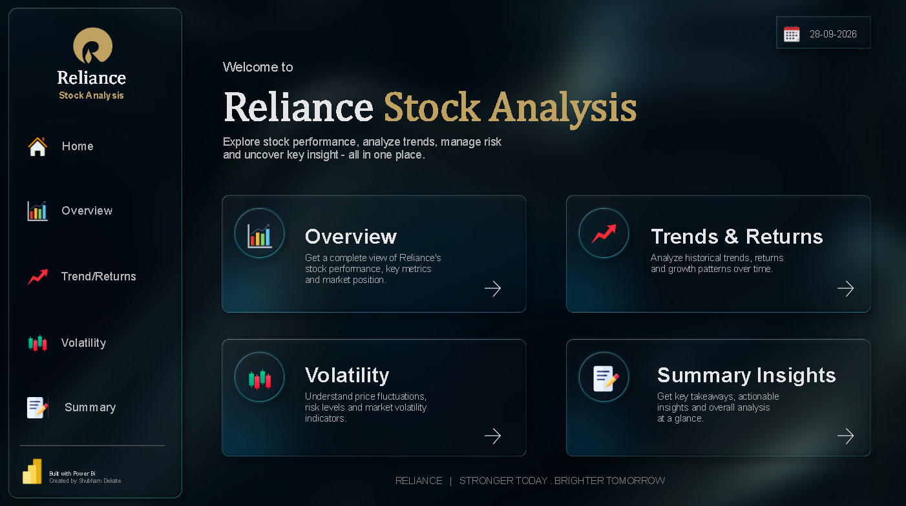
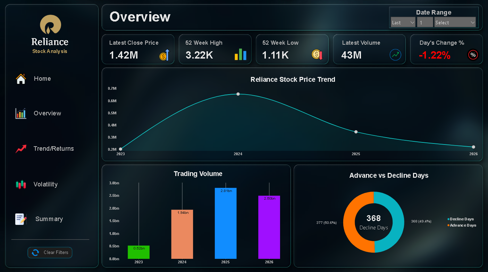
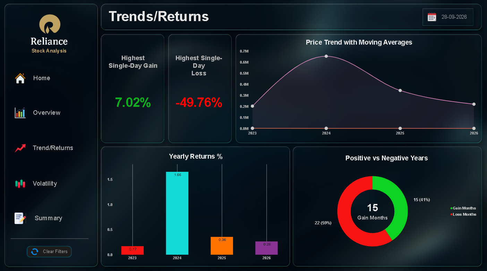
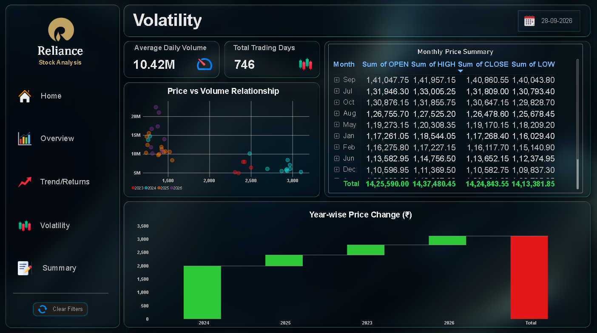
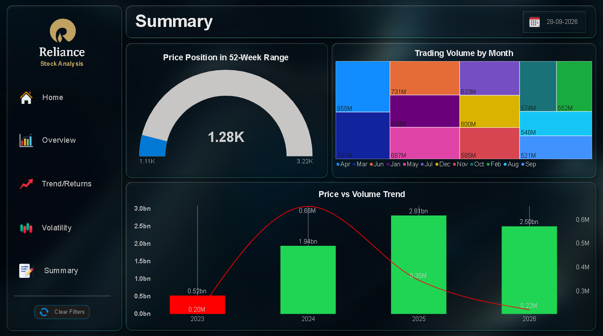

<div align="center">

# 📈 Reliance Industries — Stock Analysis Dashboard

**An interactive, dark-themed Power BI dashboard analysing 3+ years of Reliance Industries (NSE) stock data**


### 🔴 [**View Live Dashboard →**](YOUR_POWER_BI_PUBLISH_LINK_HERE)



</div>

---

## 📌 Table of Contents
- [Project Overview](#-project-overview)
- [Dashboard Preview](#-dashboard-preview)
- [Dataset](#-dataset)
- [Data Preparation](#-data-preparation)
- [Dashboard Pages](#-dashboard-pages)
- [Key DAX Measures](#-key-dax-measures)
- [Key Insights](#-key-insights)
- [Tools & Skills](#-tools--skills)
- [How to Use](#-how-to-use)
- [Author](#-author)

---

## 🎯 Project Overview

This project analyses the historical price and volume behaviour of **Reliance Industries Ltd. (NSE: RELIANCE)** from **2023 to 2026**. The dashboard helps answer questions such as:

- How has the stock price trended over time?
- Where does the current price sit in its 52-week range?
- Which years and months delivered the best returns?
- How do trading volume and price move together?
- How do the 50-day and 200-day moving averages signal trend direction?

The report is built as a 5-page, navigation-driven Power BI dashboard with a consistent dark theme.

---

## 🖼️ Dashboard Preview

| Overview | Trends & Returns |
|:---:|:---:|
|  |  |

| Volatility | Summary |
|:---:|:---:|
|  |  |

> 🎥 **Demo video:** _add link here_

---

## 📂 Dataset

| Detail | Info |
|---|---|
| **Source** | NSE India — Historical Data (Equity: RELIANCE) |
| **Period** | 2023 – 2026 |
| **Frequency** | Daily |
| **Format** | CSV (downloaded year-wise, combined in Power Query) |

**Columns used:** Date, Open, High, Low, Close, Prev. Close, LTP, Volume, VWAP, 52 Week High, 52 Week Low

---

## 🧹 Data Preparation

1. Downloaded NSE historical data as separate yearly CSV files (NSE allows ~1 year per download)
2. Loaded all files using **Get Data → Folder → Combine & Transform**
3. Removed unnecessary columns: `Series`, `Source.Name`, `Value`, `No. of Trades`
4. Verified data types (Date → Date, price columns → Decimal, Volume → Whole Number)
5. Created calculated columns: **Year** and **Month** from the Date field

---

## 📊 Dashboard Pages

### 🏠 Home
Cover page with project title and navigation buttons to every page.

### 1️⃣ Overview
| Visual | Purpose |
|---|---|
| KPI Cards (5) | Latest Close, 52-Week High, 52-Week Low, Latest Volume, Day's Change % (red/green) |
| Line Chart | Price trend over time |
| Bar Chart | Trading volume over time |
| Donut Chart | Gain vs Loss distribution |
| Date Slicer + Clear Filters button | Interactive time filtering |

### 2️⃣ Trends & Returns
| Visual | Purpose |
|---|---|
| Line Chart | Close price with 50-day & 200-day moving averages |
| KPI Cards | Highest single-day gain % and loss % |
| Column Chart | Yearly returns % |
| Donut Chart | Gain months vs loss months |

### 3️⃣ Volatility
| Visual | Purpose |
|---|---|
| KPI Cards | Average daily volume, total trading days |
| Scatter Chart | Price vs volume relationship (month-wise) |
| Matrix | Monthly price summary (Open / High / Low / Close) |
| Waterfall Chart | Year-wise price change (₹) |

### 4️⃣ Summary
| Visual | Purpose |
|---|---|
| Gauge | Current price position within 52-week range |
| Treemap | Trading volume by month |
| Combo Chart | Price (line) vs volume (columns) |

---

## 🧮 Key DAX Measures

**Day's Change %**
```DAX
Day's Change % =
VAR LatestDate = MAX('stock project row data'[Date])
VAR TodayClose = CALCULATE(MAX('stock project row data'[Close]), 'stock project row data'[Date] = LatestDate)
VAR PrevClose  = CALCULATE(MAX('stock project row data'[Prev. Close]), 'stock project row data'[Date] = LatestDate)
RETURN DIVIDE(TodayClose - PrevClose, PrevClose)
```

**50 Day Moving Average** (200-day is identical with `TOPN(200, ...)`)
```DAX
50 Day MA =
AVERAGEX(
    TOPN(50,
        FILTER('stock project row data',
               'stock project row data'[Date] <= MAX('stock project row data'[Date])),
        'stock project row data'[Date], DESC),
    'stock project row data'[Close]
)
```

**Highest Single-Day Gain % / Loss %**
```DAX
Highest Gain % =
MAXX('stock project row data',
     DIVIDE('stock project row data'[Close] - 'stock project row data'[Prev. Close],
            'stock project row data'[Prev. Close]))
```

**Yearly Return %**
```DAX
Yearly Return % =
VAR StartClose = CALCULATE(MIN('stock project row data'[Close]),
    FILTER('stock project row data', 'stock project row data'[Date] = CALCULATE(MIN('stock project row data'[Date]))))
VAR EndClose = CALCULATE(MAX('stock project row data'[Close]),
    FILTER('stock project row data', 'stock project row data'[Date] = CALCULATE(MAX('stock project row data'[Date]))))
RETURN DIVIDE(EndClose - StartClose, StartClose)
```

**Other measures:** Avg Daily Volume, Total Trading Days, Yearly Price Change, Gain Months, Loss Months, Gauge Min/Max/Current values.

---

## 💡 Key Insights

- 📈 _Add your finding: overall price trend across 2023–2026_
- 📅 _Add your finding: best and worst performing year_
- 🔀 _Add your finding: 50-day vs 200-day moving average crossover observations_
- 📊 _Add your finding: which months saw the highest trading volume_

> ⚠️ **Note:** Prices are used as downloaded from NSE and are not adjusted for corporate actions (e.g. bonus issues or splits), which can inflate extreme single-day moves.

---

## 🛠️ Tools & Skills

- **Power BI Desktop** — data modelling, visuals, navigation, bookmarks
- **Power Query** — data combining & cleaning
- **DAX** — measures & calculated columns
- **Design** — dark theme, consistent layout, conditional formatting, page navigation

---

## 🚀 How to Use

1. Clone or download this repository
2. Open `stock project power bi.pbix` in **Power BI Desktop**
3. If prompted, update the data source path to your local `data/` folder
4. Or simply open the **[live dashboard](YOUR_POWER_BI_PUBLISH_LINK_HERE)** in your browser

```
📁 Reliance-Stock-Analysis
 ┣ 📁 data
 ┣ 📁 images
 ┣ 📄 stock project power bi.pbix
 ┗ 📄 README.md
```

---

## 👤 Author

**Shubham Dekate**

[](https://www.linkedin.com/in/shubham-dekate-10a57a218/)
[](https://github.com/shubhamback)

---

<div align="center">
⭐ If you found this project useful, consider giving it a star!
</div>
